# Procesverslag
**Auteur:** -Eefje Snel-

**De opdrachten:** [opdracht 1](opdracht1/index.html) en [opdracht 2](opdracht2/index.html)

Markdown is een simpele manier om HTML te schrijven.  
Markdown cheat cheet: [Hulp bij het schrijven van Markdown](https://github.com/adam-p/markdown-here/wiki/Markdown-Cheatsheet).

Nb. De standaardstructuur en de spartaanse opmaak van de README.md zijn helemaal prima. Het gaat om de inhoud van je procesverslag. Besteedt de tijd voor pracht en praal aan je website.

Nb. Door *open* toe te voegen aan een *details* element kun je deze standaard open zetten. Fijn om dat steeds voor de relevante stuk(ken) te doen.

## Bronnenlijst
  1. developer mazilla
  2. DLO
  3. https://www.youtube.com/watch?v=y1LseZjSfRw voor het schrijven van for(var kledingstukInArray = 0; kledingstukInArray < kledingstukken.length; kledingstukInArray++)
  4. https://www.codecademy.com/forum_questions/521be7a080ff33604400099 voor het begrijpen van punt 3.
  5. https://www.youtube.com/watch?v=lNJMDTSkNXo en https://www.w3schools.com/howto/howto_js_trigger_button_enter.asp om de value van het textfield in innerhtml om te zetten.
  6. https://www.w3schools.com/cssref/pr_text_white-space.php voor het schrijven van overflow hidden, ik had dat niet bedacht.
  7. https://codepen.io/thiagopiacentini/pen/YzpbdLr voor grid-gap clamp
  8. https://www.w3schools.com/cssref/sel_nth-of-type.php en https://developer.mozilla.org/en-US/docs/Web/CSS/:nth-child om de juiste selectors te gebruiken.

## Opdracht 1 plan

  
uitwerken na schetsen idee (voor week 2)

   

  ### Je storyboard:
  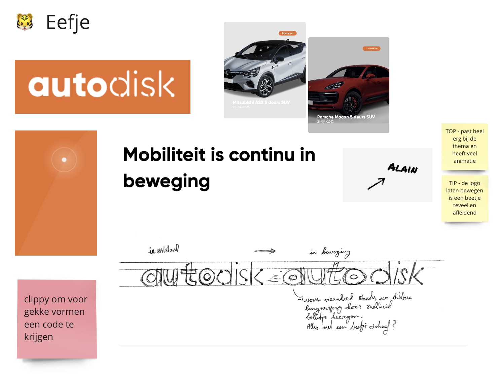

   

  ### Je ambitie: 
  Aan deze technieken/punten wil ik werken:
  - Ik vind het super leuk om gave dingen met css te maken. Ik wil graag ingewilde keyframes onder de knie krijgen.
  - Ik ben al vrij bekend met css maar sommige dingen zoals de mogelijkheden met borderradius en gradients wil ik verder ontdekken.
  - We gaan werken met before en afters, dit ken ik wel al, maar ik wil er graag beter mee kunnen werken.
 

## Opdracht 1 reflectie

  
uitwerken bij afronden opdracht (voor week 4)

   

  ### Je uitkomst - karakteristiek screenshot(s):
   De spans gaan bewegen samen en botsen tegen elkaar aan. Verder draait er een wiel met band om de Auto na te bootsen.

    

  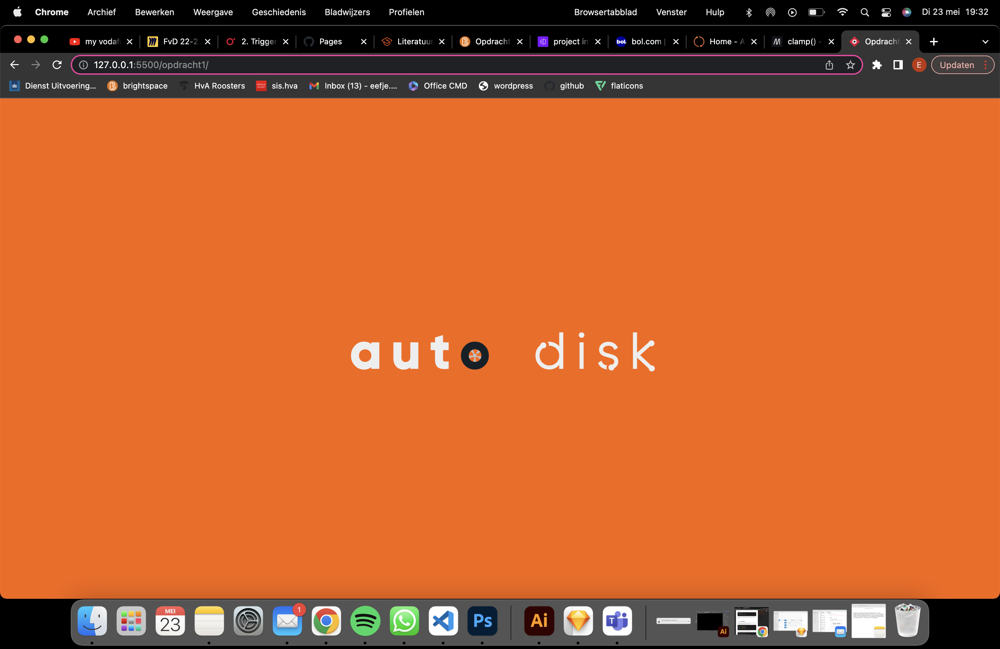
 
   

  ### Dit ging goed/Heb ik geleerd: 
  Wat er goed ging was vooral de keyframes en animaties. Dit was af en toe een beetje puzzelen, vooral met de persentages.
  Ik wilde ook meer leren over de mogelijkheden van de gradients, dit is goed gelukt met het voorbeeld op DLO. 

   

  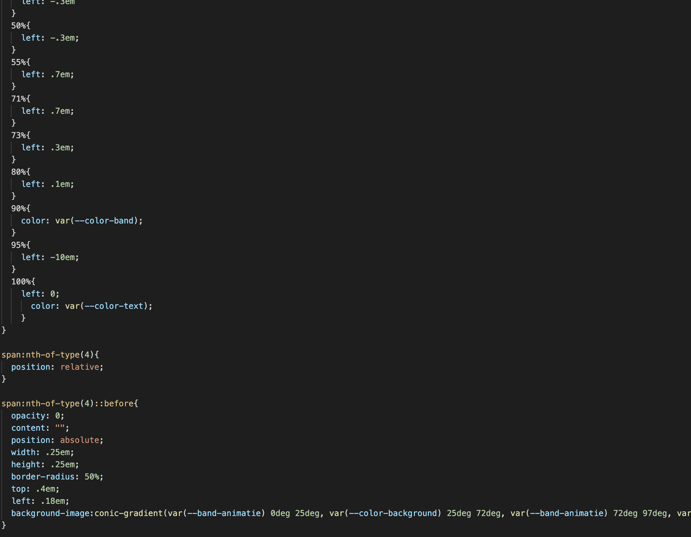

   

  ### Dit was lastig/Is niet gelukt:
  Wat wat minder goed ging was het aanroepen van animaties. 
  Ik kreeg het niet voor elkaar om alle elementen die dezelfde animatie kregen in 1 selector te zetten.
  Dit is iets waar ik graag nog naar wil kijken voor opdracht 2.

   

  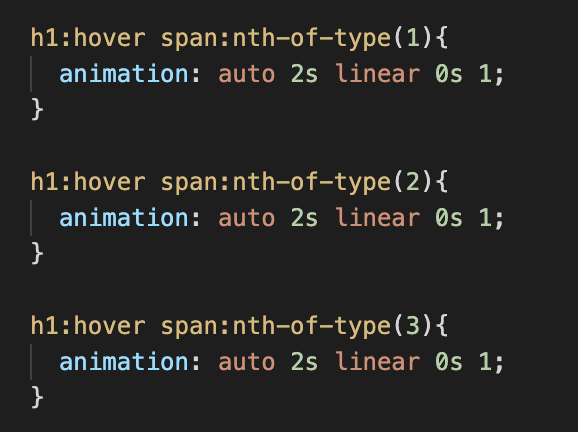

## Opdracht 2 plan

  
uitwerken na schetsen idee (voor week 5)

   

  ### Je ontwerp:
  Mijn eerste idee was om een eigen kunstwerk te kunnen maken. Ik had alleen geen enkel idee hoe ik dit moest aanpakken 

   

  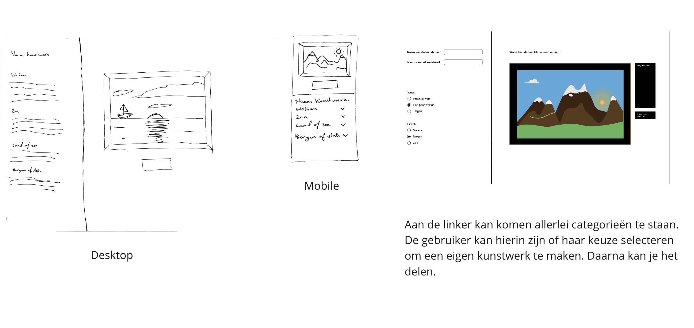

       

  Dus heb ik ervoor gekozen om iets anders te doen.
  Hier heb ik een ontwerp gemaakt voor een digitale kledingkast waaruit je een outfit kan maken.
  De kleding kan in het vak worden gesleept om een outfit te vormen.

   

  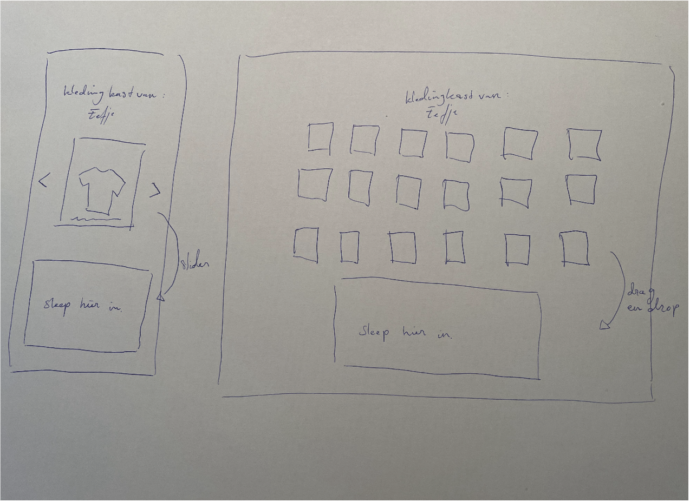

   

  ### Je ambitie: 
  Aan deze technieken/punten wil ik werken:
  - Ik wil vooral leren hoe ik libraries kan gebruiken.
  - Ik hoop 2 libraries te kunnen combineren namelijke slider en sortable
  - Ik wil heel graag meer leren over javascript schrijven. Ik vind het nog erg lastig, maar wel heel leuk om mee te werken.

## Opdracht 2 test

  
uitwerken na testen (week 7)

  Neem minimaal 5 bevindingen op:

   

  ### Bevinding 1:
  Ik wilde twee libraries combineren, maar dit was moeilijk. Het leek erop dat de drag en drop library werd uitgeschakeld zodra ik de andere library
  had toegevoegd. Ik weet nog steeds niet waarom. Maar ik kreeg het niet voor elkaar om de items uit een slider te kunnen drag en droppen.

   

  #### oplossing:
  Ik heb na een hele hoop proberen en googlen het voor elkaar gekregen om een eigen slider te maken. Ik moet zeggen dat ik dit verschrikkelijk moeilijk
  vond en met sommige code moeite heb om het te begrijpen als ik het terug lees. 

   

  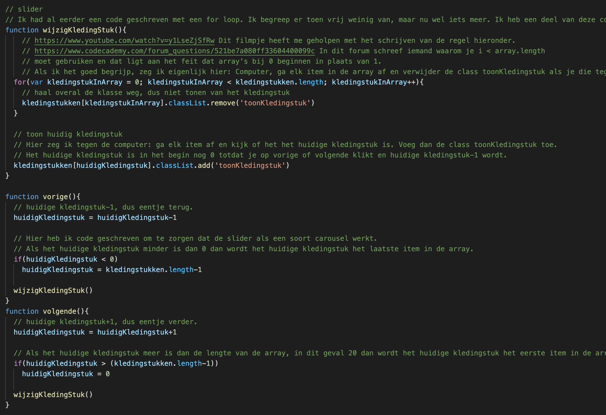

   

  ### Bevinding 2:
  Ik wilde een naam kunnen toevoegen aan de kledingkast. Dit moest met innerHTML en js. Dit ging nog redelijk, maar het kunnen bedienen met de enterbutton was iets waar ik heel veel moeite mee had.

   

  #### oplossing:
  Ik heb uiteindelijk een filmpje kunnen vinden waar het in werd uitgelegd. Blijkbaar moest ik de default uitschakelen.

   

  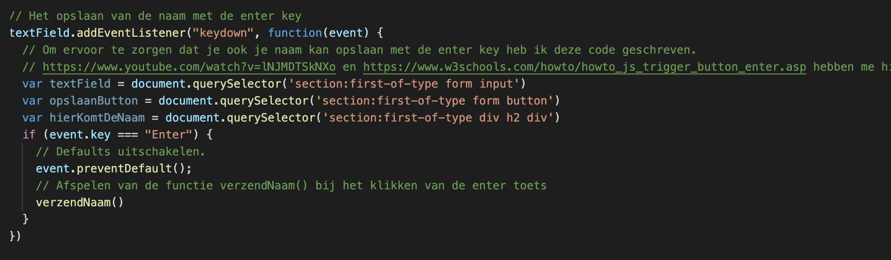

   

  ### Bevinding 3:
  De items in het dropvak paste niet op de pagina en ik kreeg ze ook niet zo snel onder elkaar.

   

  #### oplossing:
  Ik heb uiteindelijk het vak met overflow scroll kunnen laten scrollen.

   

  

   

  ### Bevinding 4:
  Toen het scrollen eenmaal werkte in het dropvak kreeg ik het probleem dat je een deel van de content niet kon bereiken.

   

  #### oplossing:
  Dit bleek te komen doordat ik een justify content center op het dropvak had gezet. Dat had ik gedaan zodat het kledingstuk mooi in het midden zou komen. Dit moest ik toen weg halen.

   

  ### Bevinding 5:
  Bij het maken van de slider ging het na een tijdje best goed, totdat de slider na een tijdje leeg was.

   

  #### oplossing:
  Dit heb ik kunnen oplossen door een if statement toe te voegen. Daarmee zei ik eigenlijk, als je onder de 0 komt, laat dan het items zien van array.lenght-1. De -1 omdat de array bij 0 begint.

   

  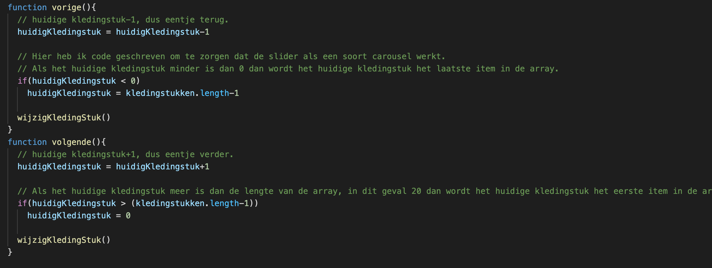

## Opdracht 2 reflectie

  
uitwerken bij afronden opdracht (voor week 8)

   

  ### Je uitkomst - karakteristiek screenshot(s):
  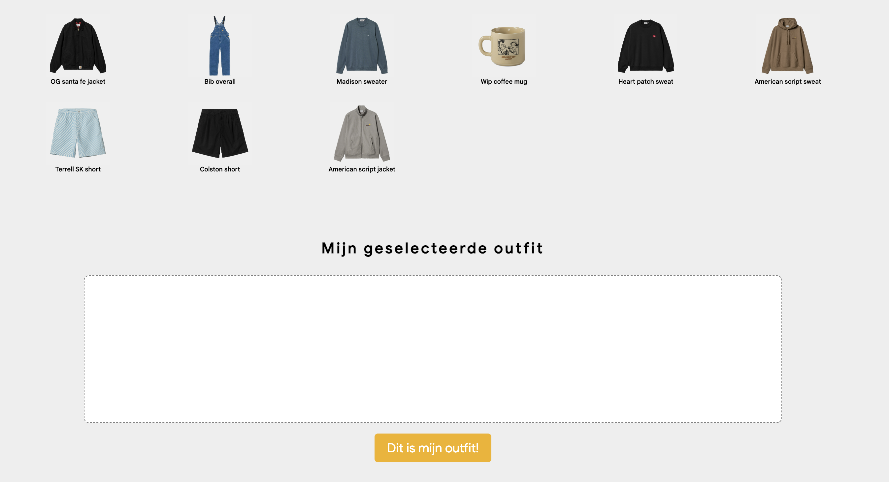
  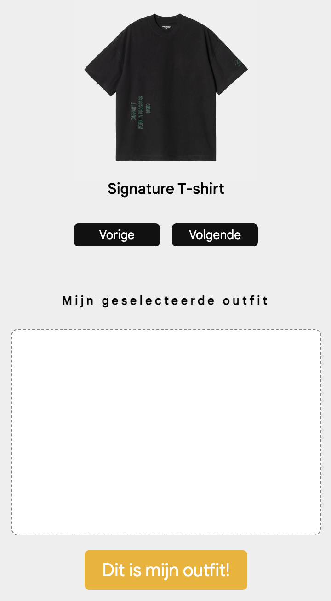

   

  ### Dit ging goed/Heb ik geleerd: 
  Ik heb echt ontzettend veel geleerd (voor mijn doen) over javascript schrijven.
  Ik vond het niet makkelijk en nu nog steeds heb ik moeite met het begrijpen, maar ik heb wel meer geleerd.
  Ik moet geduldig zijn en rustig afwachten en het helpt echt om zo veel mogelijk dingen op te zoeken en een beetje te proberen.

   

  ### Dit was lastig/Is niet gelukt:
  Wat me niet is gelukt om te doen is een empty state toevoegen op het dropvak. Ik heb exact de code overgenomen van codepen, maar het lukt maar niet.

   

  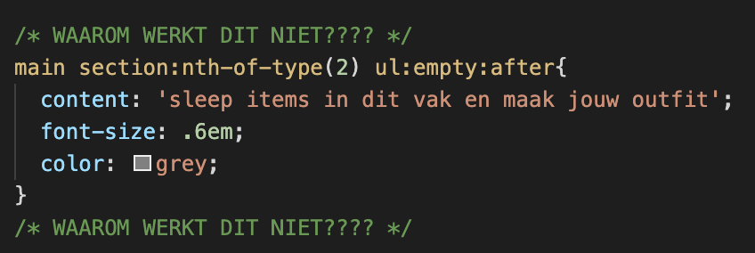

